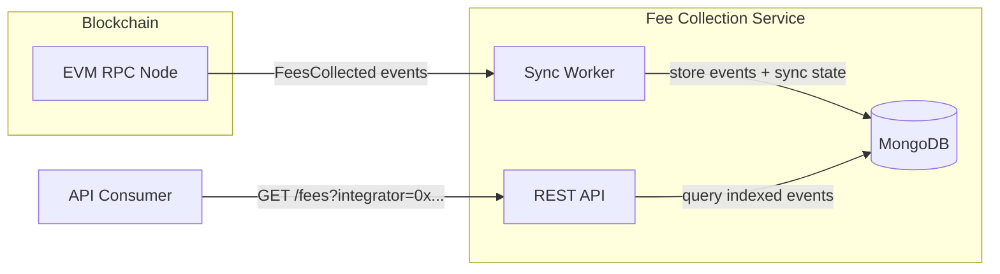

# Fee Collection Service

Fee consolidation engine for indexing `FeesCollected` events from LI.FI `FeeCollector` contracts and exposing them via REST.

## Table of Contents
- [Architecture](#architecture)
- [Feature Summary](#feature-summary)
- [Tech Stack](#tech-stack)
- [Prerequisites](#prerequisites)
- [Quick Setup](#quick-setup)
- [Running the App](#running-the-app)
- [Scripts](#scripts)
- [API Docs](#api-docs)
- [Next Steps](#next-steps)

## Architecture



The **worker** polls EVM chains via RPC for `FeesCollected` contract events, normalizes them, and stores them in MongoDB with idempotent upserts. The **API** serves those indexed events to consumers with cursor-based pagination.

## Feature summary
- Scans supported EVM chains (currently Polygon by default) for `FeesCollected` events.
- Stores normalized events in MongoDB with idempotent writes.
- Tracks chain sync state to avoid rescanning finalized blocks.
- Exposes a `GET /fees` endpoint with cursor pagination (`limit` + `cursor`).

## Tech Stack
- Node.js + TypeScript
- Express
- Ethers v5
- MongoDB + Typegoose
- Zod + OpenAPI
- Vitest + Supertest

## Prerequisites
- Docker + Docker Compose
- Node.js v18+ (optional, via Docker)
- MongoDB (optional, via Docker)

## Quick Setup
1. Clone the repo and navigate to the root directory:
```bash
git clone https://github.com/ajejoseph22/fee-collector.git
```
2. Create env file and adjust values if needed:
```bash
cp .env.template .env
```
2. Start the app
```
docker compose up
```

That's it!

The worker will start syncing fees from Polygon by default, and there will be an endpoint available at `http://localhost:8080/fees` to query the indexed fees.

You can customize worker chains by editing the `.env` file. **Only Polygon is supported for now:**
```dotenv
WORKER_CHAINS="polygon,ethereum"
```

## Running the app
### Docker Compose (recommended)
Start everything (MongoDB + API + worker):
```bash
docker compose up
```

Start only Mongo:
```bash
docker compose up -d mongo
```

Start only API (will also start Mongo if not running):
```bash
docker compose up api
```

Start only worker (will also start Mongo if not running):
```bash
docker compose up worker
```

### Docker ad-hoc:
First, start mongo if not running:
```
docker run -d --name mongo -p 27017:27017 mongo:8
```

API:
```
docker build -t fee-consolidation-service-api --target api .               
docker run -p 8080:8080 --env-file .env fee-consolidation-service-api 
```

Worker:
```
docker build -t fee-consolidation-service-worker --target worker .
docker run --env-file .env fee-consolidation-service-worker
```

### Notes
> **Scaling per chain (optional):** Instead of syncing all chains in one container, you can run a dedicated worker per chain for independent resource allocation, fault isolation, and independent restarts:
>  ```bash
>  docker run fee-consolidation-service-worker --chain polygon
>  docker run fee-consolidation-service-worker --chain ethereum # POC, currently not supported
>  ```


> **MONGO_URI** is overridden in Docker compose to point to the `mongo` service automatically.


## Scripts
- `pnpm run start:dev` — run API with file watcher (dev mode)
- `pnpm run start:prod` — run compiled API without watcher
- `pnpm run sync:fees` — run fee sync worker (continuous loop)
- `pnpm run sync:fees -- --once` — run fee sync worker for a single cycle, then exit
- `pnpm run build` — build TypeScript to JavaScript in `dist/`
- `pnpm test` — run all tests


## API Docs
### `GET /fees`
Query params:
- `integrator` (required): EVM address.
- `chainId` (optional): numeric chain id.
- `limit` (optional): defaults to `50`, max `200`.
- `cursor` (optional): opaque cursor returned by prior page.

Success response:
```json
{
  "data": [
    {
      "chainId": 137,
      "blockNumber": 78600000,
      "blockHash": "0x...",
      "txHash": "0x...",
      "logIndex": 0,
      "token": "0x...",
      "integrator": "0x...",
      "integratorFee": "100",
      "lifiFee": "20",
      "blockTimestamp": 1700000000
    }
  ],
  "cursor": "..."
}
```

Error response:
```json
{
  "error": {
    "code": "INVALID_REQUEST",
    "message": "..."
  }
}
```

## Next Steps

- **Fees endpoint auth**: The `/fees` endpoint is currently unauthenticated. Ideally, add authentication (AuthN) and authorization (AuthZ).
  - Enforce AuthZ so the authenticated integrator can only query events for its own `integrator` address.
  - If `query.integrator` does not match the caller identity/claims, return `403 Forbidden`.
  - Support privileged/admin scopes for cross-integrator reads.
  - Add audit logging for authorization decisions and rejected access attempts.
- **Distributed worker lock per chain**: Prevent multiple workers from processing the same chain concurrently.
  - Add a per-chain lease lock in MongoDB with `ownerId` and `expiresAt`.
  - Add heartbeat-based lease renewal while sync is running to avoid lock expiry during long cycles.
  - Treat lock loss as a sync failure for that chain and surface non-zero exit in `--once` mode.
  - Add lock-specific tests for acquire/release/renew, stale lock takeover, and multi-worker contention.
